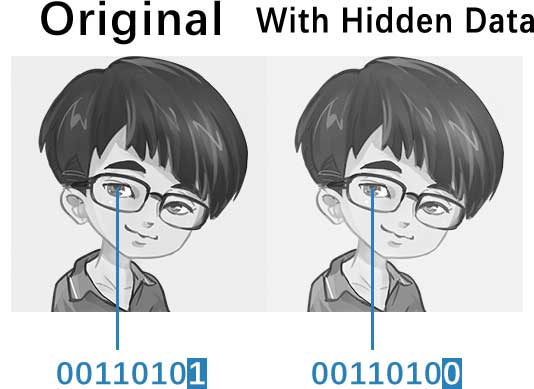

**Steganography Example in Python**
========================

Introduction
------------------------
This repository is the source code for my blog post tutorial [How To Hide a Secret Message in an Image File – Steganography in Python](http://chenyumin.com/p/how-to-hide-a-secret-message-in-an-image-file-steganography-in-python).  

  

Steganography is a way of hiding critical information. Unlike cryptography, which focuses on encrypting data, steganography focuses on concealing the data, and thus the intended secret message does not attract attention to itself as an object of scrutiny.  
This project is a simple example of concealing a hidden messages in an image file. 

Licensing
------------------------
Please see the file named [LICENSE.md](LICENSE.md).

Author
------------------------
* Chen Yumin  

Contact
------------------------
* Chen Yumin: [*http://chenyumin.com/*][1]
* CharmySoft: [*http://CharmySoft.com/*][2]  
* Email: [*hello@chenyumin.com*](mailto:hello@chenyumin.com)  

[1]: http://chenyumin.com/ "Chen Yumin"
[2]: http://www.CharmySoft.com/ "CharmySoft"